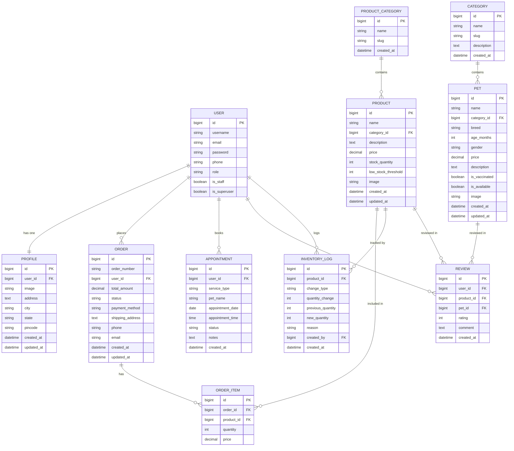
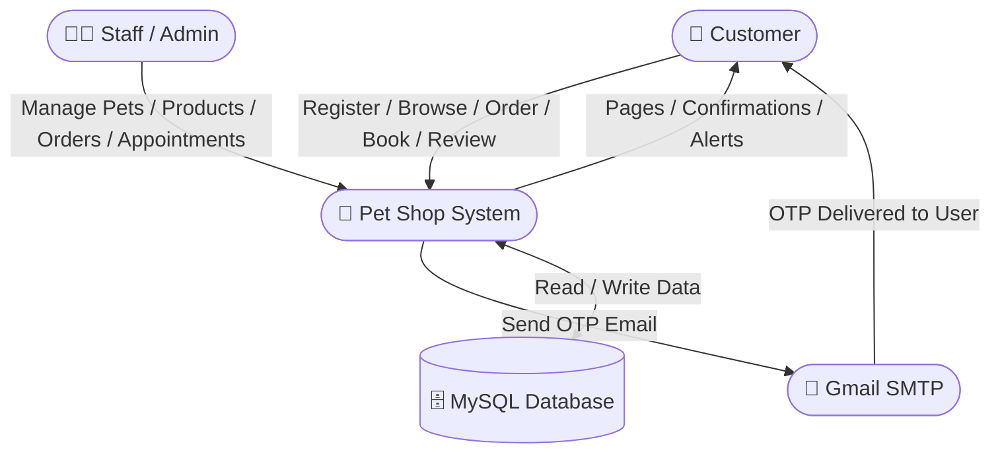
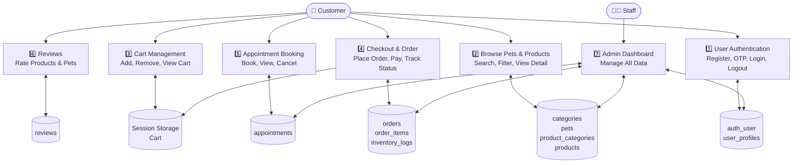
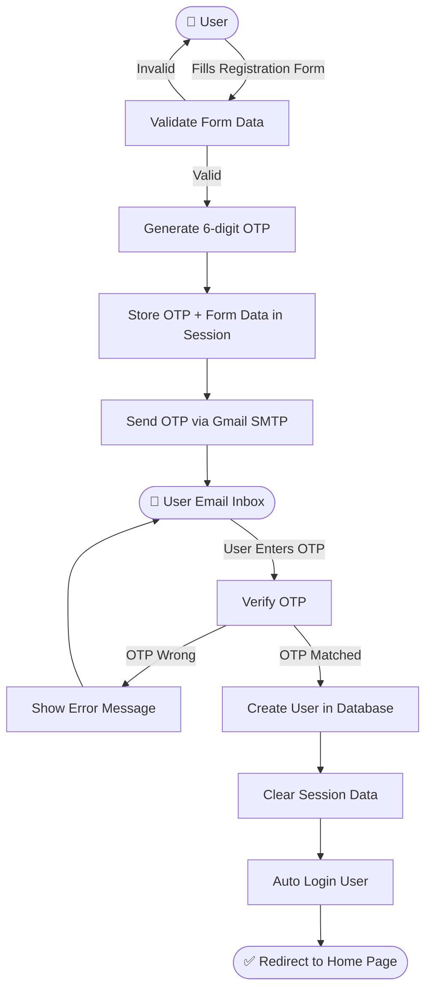
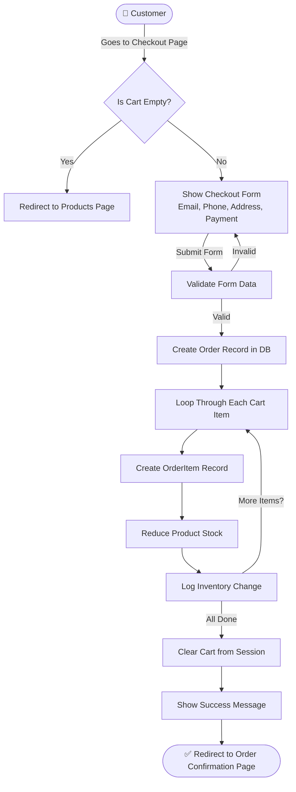
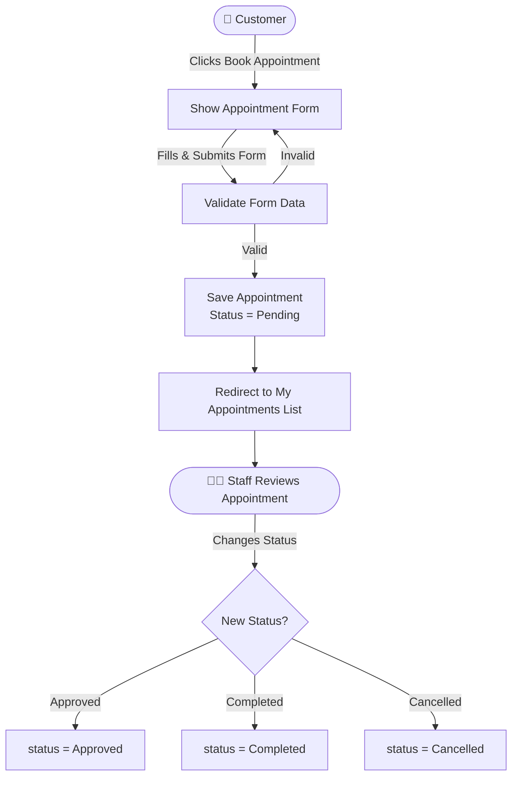
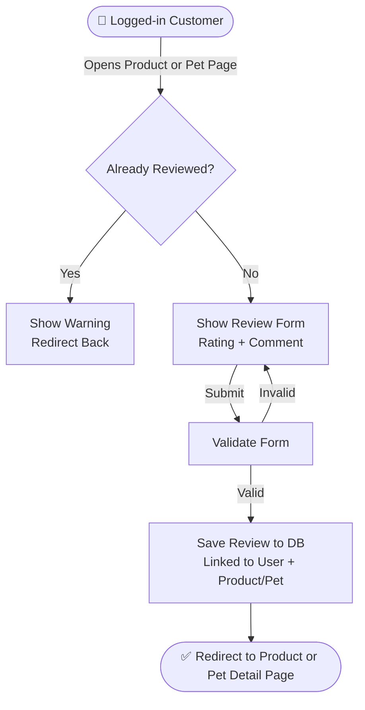

# 🐾 Pet Shop — ER Diagram & Data Flow Diagram (DFD)

---

## 📊 Entity Relationship (ER) Diagram

---

## 🔄 DFD — Level 0 : Context Diagram

---

## 🔄 DFD — Level 1 : Main Processes

---

## 🔄 DFD — Level 2 : Registration & OTP Flow

---

## 🔄 DFD — Level 2 : Checkout & Order Flow

---

## 🔄 DFD — Level 2 : Appointment Booking Flow

---

## 🔄 DFD — Level 2 : Review Submission Flow

---

## 📌 Table Relationship Summary

| Table | Relates To | Relationship |
|---|---|---|
| `auth_user` | `user_profiles` | One to One |
| `auth_user` | `orders` | One to Many |
| `auth_user` | `appointments` | One to Many |
| `auth_user` | `reviews` | One to Many |
| `auth_user` | `inventory_logs` | One to Many |
| `categories` | `pets` | One to Many |
| `product_categories` | `products` | One to Many |
| `products` | `order_items` | One to Many |
| `products` | `inventory_logs` | One to Many |
| `products` | `reviews` | One to Many |
| `orders` | `order_items` | One to Many |
| `pets` | `reviews` | One to Many |
